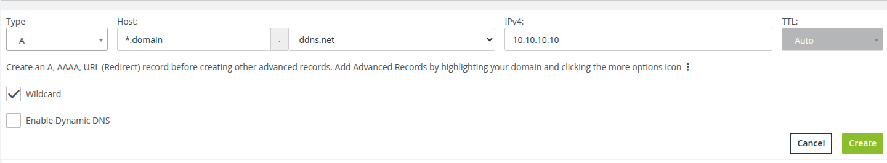

# 🏡 Home Lab Expose

Expose your home lab services securely to the internet using dynamic DNS and reverse proxy solutions.

---

## 🚀 Overview

**Home Lab Expose** helps you make your self-hosted services accessible from anywhere, using free dynamic DNS providers and simple reverse proxy configuration. Perfect for hobbyists, developers, and anyone running a home server.

---

## 🛠️ Features

- 🌐 Securely expose local services
- 🔄 Dynamic DNS support
- 🔁 Reverse proxy configuration
- 📝 Easy setup and customization

---

## 🔗 Useful Links

- [DuckDNS](https://www.duckdns.org/)
    Free, easy-to-use dynamic DNS service.
    Example: `yourdomain.duckdns.org`

- [Redirect.Pizza](https://redirect.pizza/)
    Simple, reliable URL redirection service.
    Example: Redirect `yourdomain.duckdns.org` to your public IP or service.

---

## 💡 Example Use Case

- Host a private wiki at `wiki.yourdomain.duckdns.org`
- Expose your home automation dashboard at `home.yourdomain.duckdns.org`
- Redirect old URLs to new services using Redirect.Pizza

---

## ⚙️ Configuration
- create a (NoIP domain)[]
- configure the domain like this: 
- configure `example_config.yaml` file with your DNS and API-Keys
- rename the `example_config.yaml` to `config.yaml`
- its recommended to add the container to a docker network in which only the containers are which he exposes them.
- run the service with `docker compose up`
---
